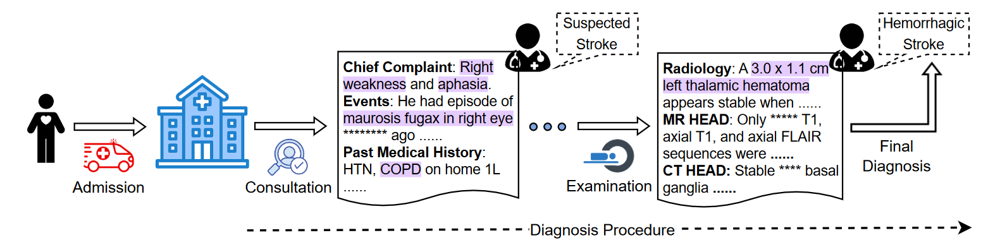

# DiReCT: Diagnostic Reasoning for Clinical Notes via Large Language Models 
This repository is the official implementation of [DiReCT](https://arxiv.org/abs/2408.01933). It contains the codes for running the baseline method as well as automatic evaluation. 
Our dataset aims to assess the ability of large language model in aligning with human doctor in diagnostic reasoning for clinical notes.


## Data Set
Our dataset is now available at [PhysioNet](https://doi.org/10.13026/yf96-kc87) . Several samples of annotated data 
(they are synthesis data not from MIMIC) are available in the "samples" folder.

Data annotation and structure refer to [Annotation and Tools](https://github.com/wbw520/DiReCT/tree/master/utils/data_annotation) <br>
Data list and loading refer to [Data Loading and Analysis](https://github.com/wbw520/DiReCT/tree/master/utils/data_loading_analysisi)

## Implementation of Baseline Experiment
We show the implementation for LLama3-8B and GPT Azure.
For [LLama3](https://github.com/meta-llama/llama3), we use the official code on GitHub. Refer to their settings to prepare the environments and download the pre-trained models. 
The final output is save in a JSON file in a dictionary structure as: {o: [z, r, d] ...}. r means the part of the clinical note where o is extracted. 
An prediction folder "predict_" will be generated.
#### Experiment with LLama3
Using the following command for the calculation of annotated samples. Set --use_p as True for utilizing the premise in knowledge graph. A folder of "predict_Meta-Llama-3-8B-Instruct" will be generated.
```
torchrun --nproc_per_node 1 llama3_diagnosis.py --ckpt_dir Meta-Llama-3-8B-Instruct/ --tokenizer_path Meta-Llama-3-8B-Instruct/tokenizer.model  --root samples --use_p False
```
#### Experiment with GPT Azure
Fill in your Azure GPT API. A folder of "predict_Your Model" will be generated.
```
from gpts_diagnosis import USE_GPT_API

USE_GPT_API(root="samples", use_p=False, api_key="Your key", azure_endpoint="Your endpoint", api_version="Your API version", model="Your Model")
```

## Automatic Evaluation
We use the LLama3-8B for this evaluation. Our prompts refer to utils/data_extraction.py <br>
With functions: discriminate_similarity_observation() and  discriminate_similarity_reason()
#### Evaluation for Completeness and Faithfulness
An evaluation folder "_eval" will be generated for all prediction. Each prediction has a evaluation results, show the matched observations and rationales.
Run the following comment for evaluation (Llama3 for example).
```
torchrun --nproc_per_node 1 evaluation.py   --ckpt_dir Meta-Llama-3-8B-Instruct/     --tokenizer_path Meta-Llama-3-8B-Instruct/tokenizer.model  --root samples --pred_name predict_Meta-Llama-3-8B-Instruct
```
#### Results Statistics
Run the following code to show the statistics of metrics for each sample (Llama3 for example).
```
from statistics import process

process(root="samples", pred_name="predict_Meta-Llama-3-8B-Instruct_eval")
```
## Publication

If you want to use this work, please consider citing the following paper.
```
@article{wang2024direct,
 title = {DiReCT: Diagnostic Reasoning for Clinical Notes via Large Language Models},
 author = {Bowen Wang and Jiuyang Chang and Yiming Qian and Guoxin Chen and Junhao Chen and Zhouqiang Jiang and Jiahao Zhang and Yuta Nakashima and Hajime Nagahara},
 journal={arXiv preprint arXiv:2408.01933},
 year = {2024}
}
```
