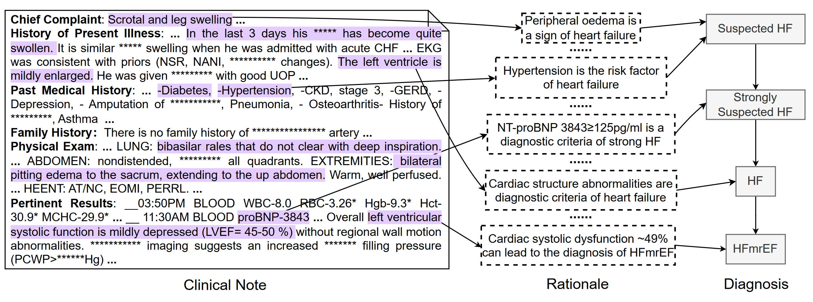
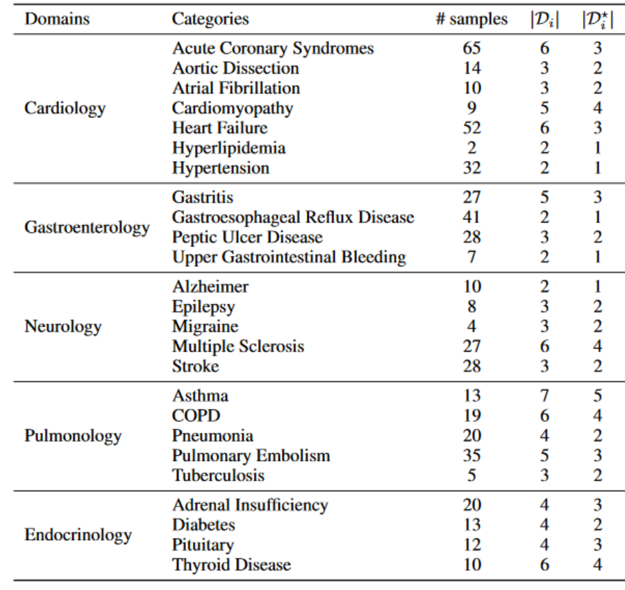

# Data Annotation
## Annotation for DiReCT
We demonstrate our data annotation here. Here is a sample for the annotation of Heart Failure (HF). Physicians are ask to find the observation "purple" from
the clinical note and provide the rationale why it causes the disease during diagnostic procedure.


Our annotation tool is provided as "annotation tool.exe". We developed it by ourselves and current no license from Microsoft (alert safety information).
You can read the JSON file in "samples" folder to show the annotation results. The detailed annotation guideline is provided in [Annotation Guideline](https://github.com/wbw520/DiReCT/blob/master/utils/data_annotation/annotation%20guideline.pdf)

The statisics of all disease categories are shown as following. # samples shows the number of notes, second to last column shows all diagnosis through the diagnostic process, and the last column show the number of leaf diagnosis.



## Diagnostic Knowledge Graph
The knowledge graph for each disease category is saved as JSON file in "diagnostic_kg" folder. 
Key of "diagnostic" represent the diagnostic procedure (in a tree structure), from a d of suspected a disease to the final diagnosis. Key of "knowledge" records the premises for each diagnosis d. Note that each premise is separated with ";".

A subgraph sample for Heart Failure is shown as following:
```
{"diagnostic": 
    {"Suspected Heart Failure": 
        {"Strongly Suspected Heart Failure": 
            {"Heart Failure": 
                {"HFrEF": [], 
                 "HFmrEF": [], 
                 "HFpEF": []}}}},
"knowledge": 
    {"Suspected Heart Failure": 
        {"Risk Factors": "CAD; Hypertension; Valve disease; Arrhythmias; CMPs; Congenital heart disease, Infective; Drug-induced; Infiltrative; Storage disorders; Endomyocardial disease; Pericardial disease; Metabolic; Neuromuscular disease; etc.", 
         "Symptoms": "Breathlessness; Orthopnoea; Paroxysmal nocturnal dyspnoea; Reduced exercise tolerance; Fatigue; tiredness; increased time to recover after exercise; Ankle swelling; Nocturnal cough; Wheezing; Bloated feeling; Loss of appetite; Confusion (especially in the elderly); Depression; Palpitation; Dizziness; Syncope.; etc.", 
         "Signs": "Elevated jugular venous pressure; Hepatojugular reflux; Third heart sound (gallop rhythm); Laterally displaced apical impulse; Weight gain (>2 kg/week); Weight loss (in advanced HF); Tissue wasting (cachexia); Cardiac murmur; Peripheral edema (ankle, sacral, scrotal); Pulmonary crepitations; Pleural effusion; Tachycardia; Irregular pulse; Tachypnoea; Cheyne-Stokes respiration; Hepatomegaly; Ascites; Cold extremities; Oliguria;  Narrow pulse pressure."}, 
     "Strongly Suspected Heart Failure": "NT-proBNP > 125 pg/mLor BNP > 35 pg/mL\n", 
     "Heart Failure": "Abnormal findings from echocardiography\uff1aLV mass index ≥ 95 g/m2 (Female), ≥ 115 g/m2 (Male); Relative wall thickness >0.42, LA volume index>34 mL/m2, E/e' ratio at rest >9, PA systolic pressure >35 mmHg; TR velocity at rest >2.8 m/s, etc.", 
     "HFrEF": "LVEF<40%", 
     "HFmrEF": "LVEF41~49%", 
     "HFpEF": "LVEF>50%"}}
```